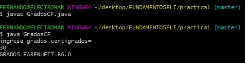

# Practicas 1 y 2

<h4>Desarrollo</h4>

Realize la busquedada de como convertir grados  c° a f°.
Tambien busque como pedir un dato al usuario.

<h3>PROGRAMA PARA CONVERTIR DE GRADOS CENTIGRADOS A FARENHEIT</h3>
Con este programa se puede ingresar una cantidad de grados c° para luego convertirlo a grados F°.

<h4>Resultado</h4>

<h3>PROGRAMA QUE INDICA EL SALARIO DE UN TRABAJADOR</h3>

ingresar el numero de hora que trabaja un empleado para luego multiplicarlo por el salario que asigne el jefe.

<h4>Resultado</h4>

<h3>CONCLUSION</h3>

Con estas practicas aprendi a como pedir datos al usuario.

<h3>RESPUESTA A LAS PREGUNTAS DEL CUESTIONARIO</h3>

<h5> 1.-¿Que comando de git se utilizan para clonar un repositorio a su computadora local?</h5> git clone

<h5>¿Como se utiliza?</h5> Cada versión de cada archivo de la historia del proyecto es descargada por defecto cuando se ejecuta git clone.
Puedes clonar un repositorio con git clone [url]. Por ejemplo, si quieres clonar la librería de Git llamada libgit2 puedes hacer algo así: 

$ git clone https://github.com/libgit2/libgit2
Esto crea un directorio llamado libgit2, inicializa un directorio .git en su interior, descarga toda la información de ese repositorio y saca una copia de trabajo de la última versión. Si te metes en el directorio libgit2, verás que están los archivos del proyecto listos para ser utilizados. Si quieres clonar el repositorio a un directorio con otro nombre que no sea libgit2, puedes especificarlo con la siguiente opción de línea de comandos:

$ git clone https://github.com/libgit2/libgit2 mylibgit
Ese comando hace lo mismo que el anterior, pero el directorio de destino se llamará mylibgit.

 <h5>2.- Explique para que sirve y como se usa el comando ”git pull”:</h5>

Sirve para actualizar el repositorio al commit mas nuevo.

El comando git pull ejecuta en primer lugar git fetch, que descarga el contenido del repositorio remoto especificado. Después, se ejecuta git merge para fusionar las referencias y los encabezados del contenido remoto en una nueva confirmación de fusión local. 

  <h5>3.- ¿Que pasa si esta colaborando en un proyecto con otra persona, ambos clonan el
repositorio de github y ambos actualizan el mismo archivo, su colaborador hace un
push y le dice a usted que haga un pull?</h5>

Se crea un error y no permite descargar el repositorio.

