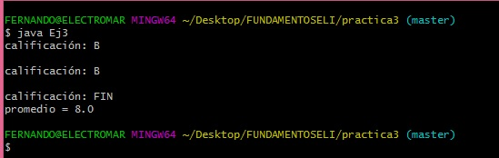
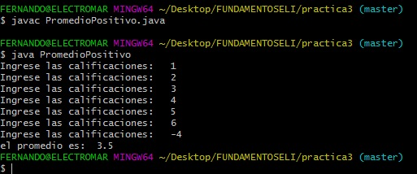
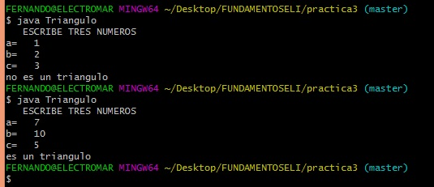

# Practica 3

<h4>Ejercicio 1</h4>

En el ejercicio 1 se paso de if a switch el problema tres de la pratica que se realizo en  clase.

<h4>Resultados<h4>

<h4>Ejercicio 2</h4>

 El usuario ingresa los numeros positivos y  cuando se ingresa un numero negativo se calcula el promedio. Se utilizo un ciclo do-while y un if.

<h4>Resultados<h4>

<h4>Ejercicio 3</h4>

En el ejercicio se introducen tres numero con los cuales el programa nos dira si se puede formar un triangulo o no.

<h4>Resultados<h4>

