# REPORTE PRACTICA 6

<h4>EJERCICIO 1</h4>

En este programa solicita las medidas de un trerreno las cuales nombramos a,b,c. y al efectura diversas operaciones se obtiene el area del terreno.

<h4>Resultado</h4>

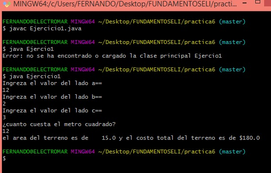                                                                                                         
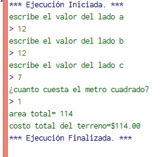

<h4>EJERCICIO 2</h4>

En este ejercicio nos pide el tipo de hambuerguesa qu edesea comprar, posteriormente si su pago va a ser en efectivo o con tarjeta y al nal muestra la cantidada total de pago.

<h4>Resultado</h4>

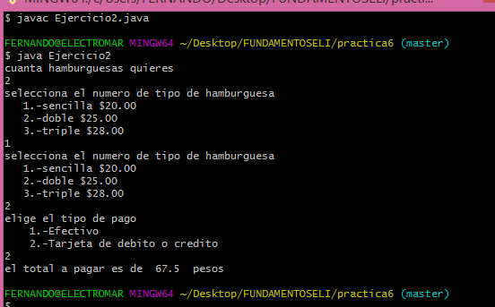                                                   

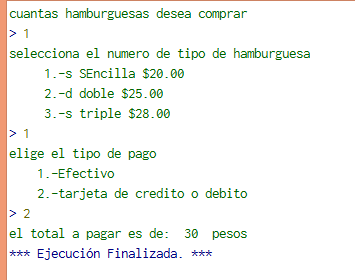  

<h4>EJERCICIO 3</h4>

En este programas nos pide ingrezar el tipo de tarjeta y con base en esa se aplicara un porcentaje diferente para el aumento de credito.
Al ginal mostrara el aumento de credito.

<h4>Resultado</h4>

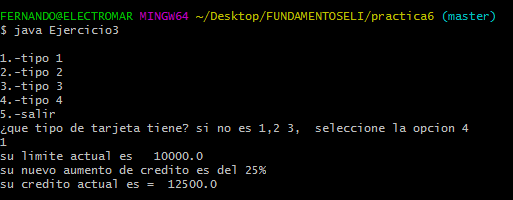                                                                                                                        

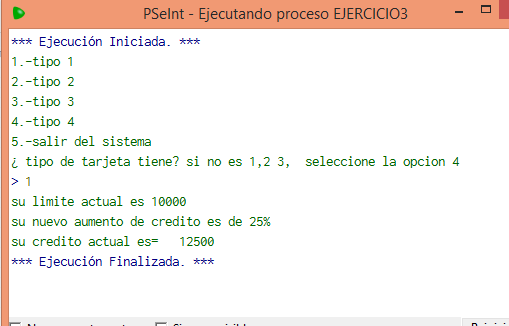 

<h4>EJERCICIO 4</h4>

En este programa nos pide ingrezar el ahorro mensual y muestra el ahorro por cada mes y el ahorro total en un año.

<h4>Resultado</h4>

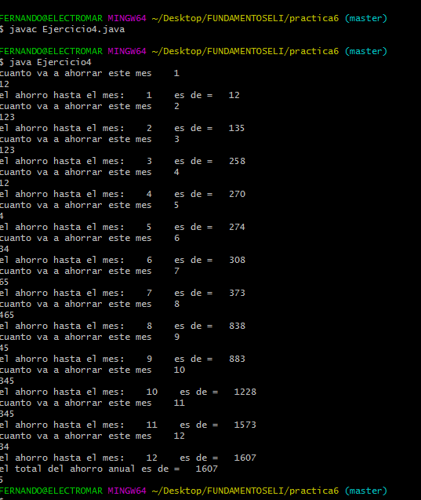                                                                                                                                     

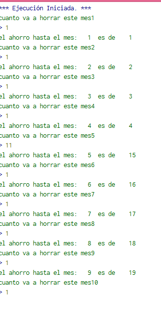 

<h4>EJERCICIO 5</h4>

En este programa ingrezamos el numero de ventas y las clasifica en tres clases mayores a mil, menore a mil y mayores a quinientos y por ultimo las ventas menores quinientos.

Al final muestra el numero de ventas de cada tipo, total de cada una de ellas y el total en general de ventas.

<h4>Resultado</h4>

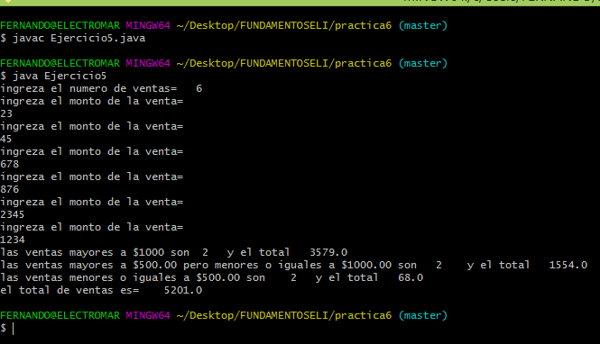      

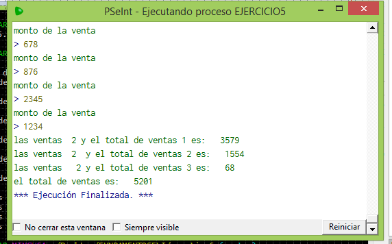 

<h4>EJERCICIO 6</h4>

En este programa se agrego el metodo de factorial, combinaciones yel de Exp(x).

<h4>Resultado</h4>

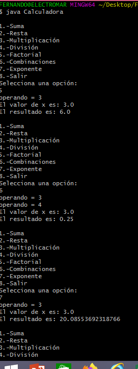 

